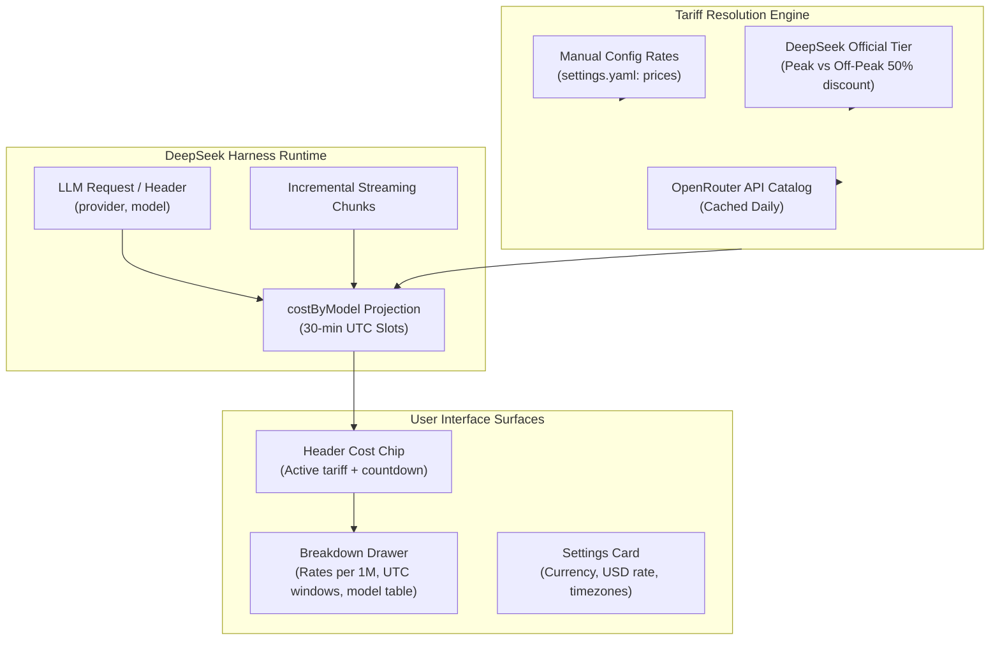

# 📦 @goodandready/dsh-cost-meter

<div align="center">

<h3>Live Session Cost Chip, Peak/Off-Peak Tariff Switcher & Token Pricing for DeepSeek Harness</h3>

<p align="center">
  <a href="https://www.npmjs.com/package/@goodandready/dsh-cost-meter"></a>
  <a href="LICENSE"></a>
  <a href="https://github.com/topics/dsh-plugin"></a>
  <a href="https://nodejs.org"></a>
</p>

<!-- Author Showcase Link -->
<p align="center">
  <a href="https://goodandready.app/"></a>
</p>

<p align="center">
  <a href="README.md"><b>🇬🇧 English</b></a> •
  <a href="docs/README.ru.md"><b>🇷🇺 Русский</b></a> •
  <a href="docs/README.zh.md"><b>🇨🇳 中文说明</b></a>
</p>

</div>

---

## ⚡ Overview & The Problem

AI development and agentic coding consume large volumes of tokens across prompt generation, reasoning, and context caches. Without continuous financial feedback, developers risk unexpected billing spikes, missing off-peak discount windows, or failing to identify runaway subagent expenses.

**`@goodandready/dsh-cost-meter`** embeds a high-precision cost telemetry chip directly into the DeepSeek Harness conversation header (`conversation.session.header.utilities`):

```text
● ≈ $0.12  0:17     ← Live session cost chip with tariff countdown
```

Clicking the chip expands an interactive breakdown modal displaying 1M token rate tables across peak and off-peak tiers, active UTC window status, and per-model session expenditure summaries.

---

## 🏛️ Architecture



---

## ✨ Features & Key Capabilities

1. **Incremental Streaming Telemetry**: Computes prompt, completion, and cache read/write tokens in real-time without polling or UI stutter.
2. **Dual-Tier Tariff Engine**: Official DeepSeek peak windows (01:00–04:00 and 06:00–10:00 UTC) with automatic 50% off-peak discount detection.
3. **UTC Half-Hour Slot Immutability**: Historical session expenditure is permanently anchored to the rate active at the moment of execution.
4. **Provider-Aware Routing**: Distinguishes direct provider connections from hosted gateways (e.g. OpenRouter vs native endpoints).
5. **Interactive UI Modal & Settings**: Custom currency symbols (`$`, `€`, `₽`, `¥`), exchange rates, and timezone configurations.

---

## 📦 Installation

```bash
dsh plugin --profile web add @goodandready/dsh-cost-meter
```

Restart your DeepSeek Harness instance and refresh the browser.

---

## ⚙️ Configuration Reference (`settings.yaml`)

```yaml
dsh-cost-meter:
  currency: "$"
  usdRate: 1.0
  displayTimeZone: "UTC"
  useOpenRouter: true
  prices: {}
  modelMap: {}
```

### Configuration Parameters

| Parameter | Type | Default | Description |
|:---|:---|:---|:---|
| `currency` | `string` | `"$"` | Display currency symbol or code |
| `usdRate` | `number` | `1.0` | Exchange rate multiplier from USD |
| `displayTimeZone` | `string` | `"UTC"` | Timezone for window schedule formatting (e.g. `Europe/London`, `Asia/Shanghai`) |
| `useOpenRouter` | `boolean` | `true` | Fetch OpenRouter public catalog for fallback models |
| `prices` | `object` | `{}` | Custom override rates per 1M tokens `{ prompt, completion, cacheRead?, cacheWrite? }` |
| `modelMap` | `object` | `{}` | Model alias mappings `{ "alias": "target-model" }` |

---

## 🧪 Testing

Run the automated test suite:

```bash
npm test
```

---

## 📄 License

MIT © [GooDAnDReaDY](https://github.com/GooDAnDReaDY)
