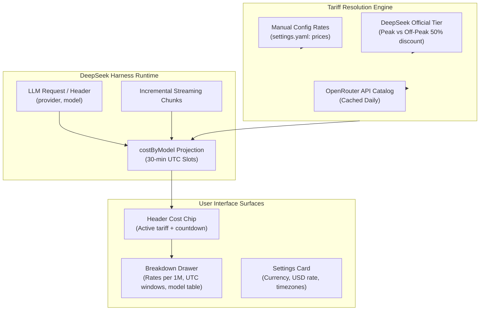

# 📦 @goodandready/dsh-cost-meter

<div align="center">

<h3>Live Session Cost Chip, Peak/Off-Peak Tariff Switcher & Token Pricing for DeepSeek Harness</h3>

<p align="center">
  <a href="https://www.npmjs.com/package/@goodandready/dsh-cost-meter"></a>
  <a href="LICENSE"></a>
  <a href="https://github.com/topics/dsh-plugin"></a>
  <a href="https://nodejs.org"></a>
</p>

<!-- Author Showcase Link -->
<p align="center">
  <a href="https://goodandready.app/"></a>
</p>

<p align="center">
  <a href="README.md"><b>🇬🇧 English</b></a> •
  <a href="README.ru.md"><b>🇷🇺 Русский</b></a> •
  <a href="README.zh.md"><b>🇨🇳 中文说明</b></a>
</p>

<table align="center">
  <tr>
    <td align="center">
      ⭐ <strong>If you like this plugin, please star it on GitHub</strong> — it shows me that the plugin is useful to you and motivates me to keep developing it.
      <br><br>
      🐛 <strong>If you find a bug or would like to request a feature</strong>, open a GitHub issue in any language — I will review your proposal and implement useful suggestions in a future plugin version.
    </td>
  </tr>
</table>

</div>

---

## ⚡ Overview & The Problem

AI development and agentic coding consume large volumes of tokens across prompt generation, reasoning, and context caches. Without continuous financial feedback, developers risk unexpected billing spikes, missing off-peak discount windows, or failing to identify runaway subagent expenses.

**`@goodandready/dsh-cost-meter`** embeds a high-precision cost telemetry chip directly into the DeepSeek Harness conversation header (`conversation.session.header.utilities`):

```text
● ≈ $0.12  0:17     ← Live session cost chip with tariff countdown
```

Clicking the chip expands an interactive breakdown modal displaying 1M token rate tables across peak and off-peak tiers, active UTC window status, and per-model session expenditure summaries.

---

## 🏛️ Architecture



---

## ✨ Features & Key Capabilities

1. **Incremental Streaming Telemetry**: Computes prompt, completion, and cache read/write tokens in real-time without polling or UI stutter.
2. **Dual-Tier Tariff Engine**: Official DeepSeek peak windows (01:00–04:00 and 06:00–10:00 UTC) with automatic 50% off-peak discount detection.
3. **UTC Half-Hour Slot Immutability**: Historical session expenditure is permanently anchored to the rate active at the moment of execution.
4. **Provider-Aware Routing**: Distinguishes direct provider connections from hosted gateways (e.g. OpenRouter vs native endpoints).
5. **Interactive UI Modal & Settings**: Custom currency symbols (`$`, `€`, `₽`, `¥`), exchange rates, and timezone configurations.

---

## 📦 Installation

```bash
dsh plugin --profile web add @goodandready/dsh-cost-meter
```

Restart your DeepSeek Harness instance and refresh the browser.

---

## ⚙️ Configuration Reference (`settings.yaml`)

```yaml
dsh-cost-meter:
  currency: "$"
  usdRate: 1.0
  displayTimeZone: "UTC"
  useOpenRouter: true
  prices: {}
  modelMap: {}
```

### Configuration Parameters

| Parameter | Scope / Location | Type | Default | Description |
|:---|:---|:---|:---|:---|
| `currency` | GUI / `settings.yaml` | `string` | `"$"` | Display currency symbol (e.g. `$`, `₽`, `€`) |
| `usdRate` | GUI / `settings.yaml` | `number` | `1.0` | Exchange rate multiplier: units of currency per 1 USD |
| `displayTimeZone` | GUI / `settings.yaml` | `string` | `"Europe/Moscow"` | IANA timezone for peak/off-peak windows formatting |
| `useOpenRouter` | GUI / `settings.yaml` | `boolean` | `true` | Automatically fetch rates & discount windows from OpenRouter |
| `refreshHours` | GUI / `settings.yaml` | `number` | `24` | Hours between periodic OpenRouter catalog updates |
| `deepseekPeakPrices` | `settings.yaml` only | `object` | `{}` | Override built-in DeepSeek peak rates by model id |
| `prices` | `settings.yaml` only | `object` | `{}` | Manual rates per 1M tokens `{ input, output, cacheHit?, cacheWrite? }` |
| `modelMap` | `settings.yaml` only | `object` | `{}` | Route override: `"provider/model"` -> OpenRouter model id |
| `manualPeakWindowsUtc` | `settings.yaml` only | `array` | `[]` | Manual peak windows HH:MM-HH:MM UTC used with manual prices |
| `manualOffPeakMultiplier` | `settings.yaml` only | `number` | `1.0` | Multiplier applied outside manual peak windows |

> **Note on GUI vs YAML**: Primary scalar parameters (`currency`, `usdRate`, `displayTimeZone`, `useOpenRouter`, `refreshHours`) are directly editable in the GUI Settings Card under **Settings → Plugins → Plugin Settings → Cost Meter**. Advanced structured rules (`prices`, `modelMap`, `deepseekPeakPrices`, `manualPeakWindowsUtc`, `manualOffPeakMultiplier`) are configured in `settings.yaml` due to their complex dictionary/array schema.

---

## 🧪 Testing

Run the automated test suite:

```bash
npm test
```

---

## 📄 License

MIT © [GooDAnDReaDY](https://github.com/GooDAnDReaDY)

### Performance & Smart Cost Features (v0.8.1)
- **O(K) Rate Change Calculation**: Next schedule transition is resolved in $O(K)$ boundary hops instead of full-day iterations.
- **Server Cache & ETag**: High-throughput state polling with `304 Not Modified` support and internal tariff LRU cache.
- **Manual Catalog Sync**: On-demand catalog fetch via `POST /dsh-cost-meter/refresh` or UI "Sync Now" button.
- **Savings Advice & Budget Threshold**: Popover hints on impending off-peak discounts (50% off) and optional warning thresholds (`budgetThreshold`).
- **Quick Summary Export**: Instant markdown/text summary copy to clipboard.

### UI Refinements & Language Standards (v0.8.2)
- **Native Dot Status Indicator**: Header chip uses a refined status dot (green for off-peak, amber for peak, pulsing red for budget overrun, neutral for flat/idle) rather than full-fill backgrounds.
- **Context Cache Savings**: Automatically calculates and highlights financial savings gained from prompt caching (e.g. `Cache saved: ≈ $0.14 (-68%)`).
- **Multi-Model Accordion**: Clean collapsible list when 3 or more models are used in a single session.
- **DSH Locale Standards**: Full English (`en`) and Chinese (`zh`) locale dictionaries registered directly in the client bundle. Russian translations are provided externally via `@goodandready/dsh-russian-lang`.
