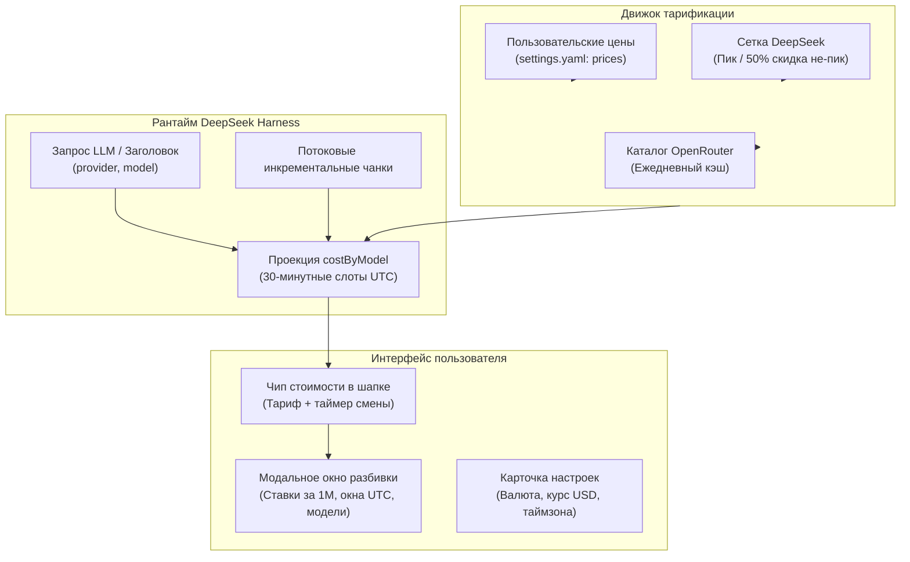

# 📦 @goodandready/dsh-cost-meter

<div align="center">

<h3>Чип стоимости сессии, переключатель пиковых тарифов и мониторинг расходов токенов для DeepSeek Harness</h3>

<p align="center">
  <a href="https://www.npmjs.com/package/@goodandready/dsh-cost-meter"></a>
  <a href="../LICENSE"></a>
  <a href="https://github.com/topics/dsh-plugin"></a>
  <a href="https://nodejs.org"></a>
</p>

<!-- Обязательная кнопка перехода на витрину всех проектов -->
<p align="center">
  <a href="https://goodandready.app/"></a>
</p>

<p align="center">
  <a href="../README.md"><b>🇬🇧 English</b></a> •
  <a href="README.ru.md"><b>🇷🇺 Русский</b></a> •
  <a href="README.zh.md"><b>🇨🇳 中文说明</b></a>
</p>

</div>

---

## ⚡ Обзор и решаемая проблема

Разработка с помощью ИИ-агентов и генерация кода требуют активного потребления токенов (промпты, рассуждения, контекстный кэш). Без непрерывного финансового контроля разработчики рискуют столкнуться с перерасходом бюджета или упустить окна 50% скидок внепикового тарифа.

**`@goodandready/dsh-cost-meter`** встраивает компактный высокоточный телеметрический чип прямо в заголовок диалога DeepSeek Harness (`conversation.session.header.utilities`):

```text
● ≈ ₽8.55  0:17     ← Чип стоимости сессии в шапке с обратным отсчётом тарифа
```

По клику открывается интерактивная панель: тарифная сетка за 1M токенов (не-пик / пик с подсветкой активного режима), статус окон в UTC и детальная разбивка расходов текущей сессии по моделям.

---

## 🏛️ Архитектура



---

## ✨ Ключевые возможности

1. **Живой расчёт во время стриминга**: расчёт стоимости инкрементально обновляется в реальном времени прямо во время генерации ответа.
2. **Двухуровневая сетка тарифов**: официальные пиковые окна DeepSeek (01:00–04:00 и 06:00–10:00 UTC) со скидкой 50% во внепиковое время.
3. **Иммутабельность получасовых слотов UTC**: исторические расходы сессии фиксируются по ставке слота и не пересчитываются задним числом при смене тарифа.
4. **Provider-aware тарификация**: раздельный учёт для прямых подключений DeepSeek и шлюзов OpenRouter.
5. **Гибкая настройка валюты**: поддержка пользовательских символов валют (`₽`, `$`, `€`, `¥`), курсов конвертации и таймзон.

---

## 📦 Установка

```bash
dsh plugin --profile web add @goodandready/dsh-cost-meter
```

Перезапустите экземпляр DeepSeek Harness и обновите страницу в браузере.

---

## ⚙️ Таблица конфигурации (`settings.yaml`)

```yaml
dsh-cost-meter:
  currency: "₽"
  usdRate: 90.0
  displayTimeZone: "Europe/Moscow"
  useOpenRouter: true
  prices: {}
  modelMap: {}
```

### Параметры конфигурации

| Параметр | Доступность | Тип | По умолчанию | Описание |
|:---|:---|:---|:---|:---|
| `currency` | GUI / `settings.yaml` | `string` | `"₽"` | Символ валюты в интерфейсе (например, `₽`, `$`, `€`) |
| `usdRate` | GUI / `settings.yaml` | `number` | `80.0` | Курс обмена: единиц валюты за 1 USD |
| `displayTimeZone` | GUI / `settings.yaml` | `string` | `"Europe/Moscow"` | IANA часовой пояс для отображения окон пика и не-пика |
| `useOpenRouter` | GUI / `settings.yaml` | `boolean` | `true` | Загружать ли каталог тарифов и скидочных окон OpenRouter |
| `refreshHours` | GUI / `settings.yaml` | `number` | `24` | Частота обновления каталога OpenRouter (в часах) |
| `deepseekPeakPrices` | Только `settings.yaml` | `object` | `{}` | Переопределение встроенных пиковых ставок DeepSeek по id модели |
| `prices` | Только `settings.yaml` | `object` | `{}` | Ручные ставки за 1M токенов `{ input, output, cacheHit?, cacheWrite? }` |
| `modelMap` | Только `settings.yaml` | `object` | `{}` | Сопоставление маршрута `"provider/model"` на id в OpenRouter |
| `manualPeakWindowsUtc` | Только `settings.yaml` | `array` | `[]` | Ручные окна пика HH:MM-HH:MM UTC для ручных ставок |
| `manualOffPeakMultiplier` | Только `settings.yaml` | `number` | `1.0` | Коэффициент тарифа вне ручных окон пика |

> **Интерфейс настроек (GUI) vs settings.yaml**: Основные параметры (`currency`, `usdRate`, `displayTimeZone`, `useOpenRouter`, `refreshHours`) настраиваются прямо в карточке интерфейса DSH (**Настройки → Плагины → Настройки плагинов → Cost Meter**). Расширенные структурированные правила сопоставления и ручных тарифов задаются через `settings.yaml` из-за сложной древовидной структуры.

---

## 🧪 Тестирование

Запуск набора юнит-тестов:

```bash
npm test
```

---

## 📄 Лицензия

MIT © [GooDAnDReaDY](https://github.com/GooDAnDReaDY)

### Производительность и интеллектуальные подсказки (v0.8.1)
- **Алгоритм O(K)**: Моментальный расчёт границ смены тарифов и мемоизация экстремумов без лишних циклов в браузере.
- **Серверный кэш и ETag**: Поддержка заголовка `304 Not Modified` для маршрута `/state` и кэширование сопоставлений моделей.
- **Ручная синхронизация**: Кнопка «Синхронизировать сейчас» в настройках с защитой от флуда (`POST /dsh-cost-meter/refresh`).
- **Подсказки экономии и порог бюджета**: Отсчёт времени до льготного окна (скидка 50%), порог сессии (`budgetThreshold`) и экспорт сводки в буфер обмена.
