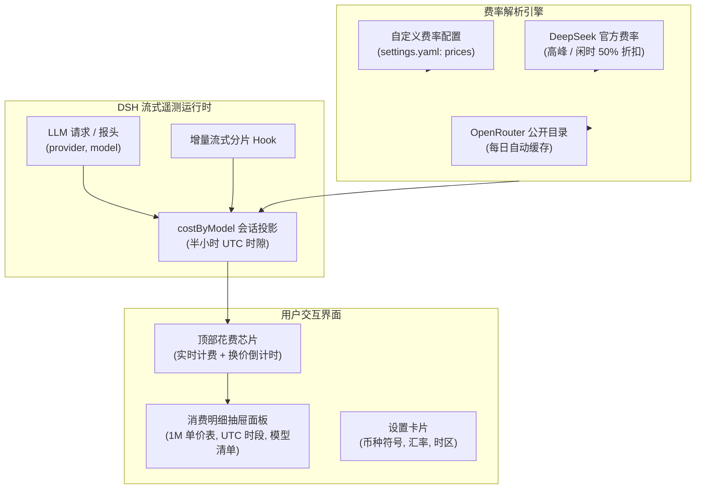

# 📦 @goodandready/dsh-cost-meter

<div align="center">

<h3>面向 DeepSeek Harness 的会话实时花费计费芯片、波峰/波谷阶梯电价与 Token 监控插件</h3>

<p align="center">
  <a href="https://www.npmjs.com/package/@goodandready/dsh-cost-meter"></a>
  <a href="../LICENSE"></a>
  <a href="https://github.com/topics/dsh-plugin"></a>
  <a href="https://nodejs.org"></a>
</p>

<!-- 作者所有项目展示页面链接 -->
<p align="center">
  <a href="https://goodandready.app/"></a>
</p>

<p align="center">
  <a href="README.md"><b>🇬🇧 English</b></a> •
  <a href="README.ru.md"><b>🇷🇺 Русский</b></a> •
  <a href="README.zh.md"><b>🇨🇳 中文说明</b></a>
</p>

<table align="center">
  <tr>
    <td align="center">
      ⭐ <strong>如果您喜欢这个插件，请在 GitHub 上为它点亮 Star</strong> — 这能让我知道插件对您有用，并鼓励我继续开发和维护它。
      <br><br>
      🐛 <strong>如果您发现 Bug 或希望增加功能</strong>，请使用任意语言在 GitHub 上提交 Issue — 我会评估您的建议，并在后续版本中实现有价值的改进。
    </td>
  </tr>
</table>

</div>

---

## ⚡ 概述与核心痛点

在使用智能体与大语言模型编程时，模型推理、长上下文以及缓存读写会产生大量 Token 消耗。如果缺乏实时的财务监控，开发者容易错过官方 50% 闲时折扣窗口，或因死循环导致账单超出预算。

**`@goodandready/dsh-cost-meter`** 在 DeepSeek Harness 会话顶部工具栏（`conversation.session.header.utilities`）无缝嵌入高精度花费微件芯片：

```text
● ≈ ¥0.85  0:17     ← 会话顶部实时花费芯片与换价倒计时
```

点击芯片可展开交互式详情面板：按每 1M Token 展示峰谷两档费率表格（高亮显示当前激活档位）、UTC 优惠时间段状态以及各模型在当前会话中的累计消费明细。

---

## 🏛️ 架构设计



---

## ✨ 核心特性

1. **增量流式实时计算**：在模型打字生成过程中毫秒级更新 Prompt、Completion 和 Cache 费用，无轮询无卡顿。
2. **两级阶梯电价引擎**：支持 DeepSeek 官方高峰时段（UTC 01:00–04:00 与 06:00–10:00）及闲时 50% 优惠折扣自动匹配。
3. **UTC 半小时时隙不可变性**：历史消费严格锁定在消耗发生时刻的时隙费率，切换费率不溯及既往。
4. **服务商智能路由**：精准区分直连 DeepSeek 服务商与 OpenRouter 等代理网关。
5. **多币种与本地化**：支持自定义货币符号（`¥`, `$`, `€`, `₽`）、汇率换算与显示时区。

---

## 📦 快速安装

```bash
dsh plugin --profile web add @goodandready/dsh-cost-meter
```

重启 DeepSeek Harness 实例并刷新浏览器页面。

---

## ⚙️ 配置项说明 (`settings.yaml`)

```yaml
dsh-cost-meter:
  currency: "¥"
  usdRate: 7.2
  displayTimeZone: "Asia/Shanghai"
  useOpenRouter: true
  prices: {}
  modelMap: {}
```

### 配置参数列表

| 参数项 | 类型 | 默认值 | 说明 |
|:---|:---|:---|:---|
| `currency` | `string` | `"¥"` | 显示的货币符号或代码 |
| `usdRate` | `number` | `7.2` | 美元到目标货币的换算汇率 |
| `displayTimeZone` | `string` | `"Asia/Shanghai"` | 界面中优惠时间段显示的参考时区 |
| `useOpenRouter` | `boolean` | `true` | 是否加载 OpenRouter 价格表作为备用 |
| `prices` | `object` | `{}` | 自定义每 1M Token 的费率覆盖 |
| `modelMap` | `object` | `{}` | 模型别名映射表 |

---

## 🧪 自动化测试

运行单元测试套件：

```bash
npm test
```

---

## 📄 许可证

MIT © [GooDAnDReaDY](https://github.com/GooDAnDReaDY)

### 界面优化与语言规范 (v0.8.2)
- **原生状态圆点指示器**：顶部芯片采用更精简的原生状态圆点（绿色代表低谷优惠，琥珀色代表高峰，红色脉冲代表超出预算上限，灰色代表平价/空闲）。
- **上下文缓存节省提示**：自动计算并高亮显示命中提示词缓存所节省的费用（例如：`上下文缓存节省：≈ $0.14 (-68%)`）。
- **多模型折叠列表**：当单次会话中使用 3 个或更多模型时，提供紧凑的可折叠模型明细展示。
- **DSH 规范双语支持**：插件内置完整的英文（`en`）与中文（`zh`）语言字典。
